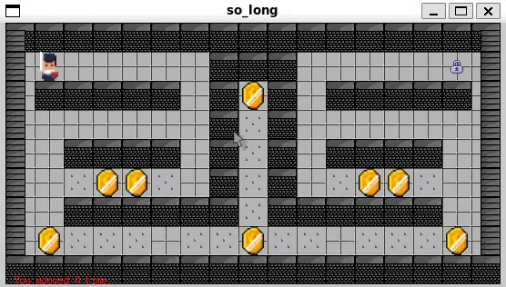

# <p align="center">SOLONG [Projet 42]</p>

<div align="center">
	<table>
		<tr><th>NOTE</th>
		<th>ENGLISH VERSION</th></tr>
		<tr><th></th>
		<th><a href= "https://github.com/mgayout/so_long/blob/main/eng/README.md"></a></th></tr>
	</table>
</div>

Le projet `SO_LONG` est un jeu en 2D, réalisé avec la bibliothèque graphique `Minilibx` (fournit par 42).

Le but de ce jeu est de collecter des `items` sur la `map` et de prendre la `sortie`.

Voici quelques exemples de fonctionnalité demandées par le sujet de `SO_LONG` :

* Se déplacer dans les 4 directions (Haut, Bas, Gauche et Droite)

* Afficher le compte total de déplacement dans le terminal

* La touche `ECHAP` (ou `ESC`) permet de quitter proprement le jeu

* La carte jouée doit contenir au minimum 1 `entrée` (position de départ), 1 `sortie` et un `item`

* ...

En plus de l'utilisation d'une bibliothèque graphique, le projet `SO_LONG` nous permet de comprendre l'utilisation d'une structure et de la gestion d'erreurs.

### <p align="center">BONUS_PART</p>

La partie `bonus` de ce projet comprends les 3 choses suivantes :

* Le joueur peut perdre la partie si il est touché par un ennemi

* Le jeu doit contenir des `sprite animations`

* Le compte total de déplacement doit être afficher directement dans la fenètre de jeu

<p align="center"></p>

## <p> </p>

## <p align="center">INSTALLATION</p>

* Pour télécharger `SOLONG` :

```shell
git clone https://github.com/mgayout/so_long.git
```
<div align="center">
	<table>
		<tr><th colspan="2" align="center">Règles</th></tr>
		<tr><td align="center">make</td>
		<td>Compilation</td></tr>
		<tr><td align="center">make bonus</td>
		<td>Compilation des fichiers bonus</td></tr>
		<tr><td align="center">make clean</td>
		<td>Suppression des fichiers objets</td></tr>
		<tr><td align="center">make fclean</td>
		<td>Suppression des fichiers objets et du programme so_long ou so_long_bonus</td></tr>
		<tr><td align="center">make re</td>
		<td>Suppression des fichiers objets et de l'archive suivi d'une compilation</td></tr>
		<tr><td align="center">make rebonus</td>
		<td>Suppression des fichiers objets et de l'archive suivi d'une compilation des fichiers bonus</td></tr>
	</table>
</div>

* Pour tester `SOLONG` :

```shell
./so_long chemin/vers/la/map.ber
```