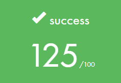
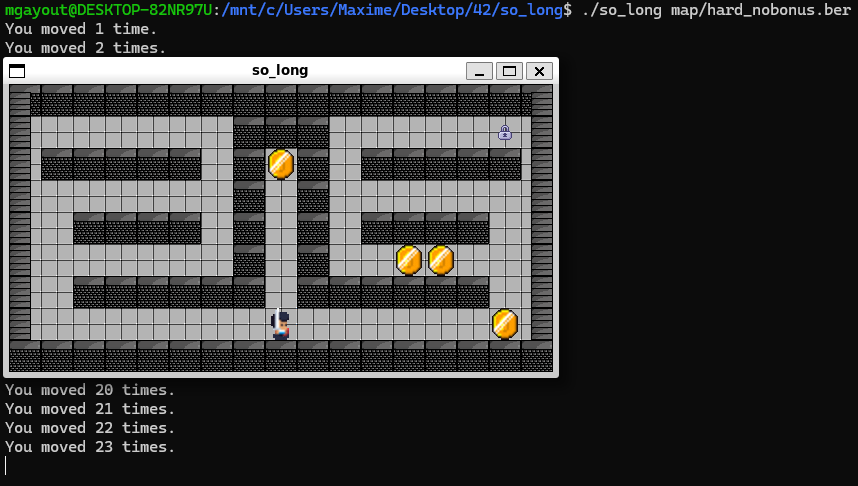

# SO_LONG

## 42 PROJECT

Le projet `SO_LONG` est un jeu en 2D, réalisé avec la bibliothèque graphique `Minilibx` (fournit par 42).

Selon le sujet, le but de ce jeu est de collecter des `items` sur la `map` et de prendre la `sortie`.

Voici quelques exemples de fonctionnalité demandées par le sujet de `SO_LONG` :

* Se déplacer dans les 4 directions (Haut, Bas, Gauche et Droite)

* Afficher le compte total de déplacement dans le terminal

* La touche `ECHAP` (ou `ESC`) permet de quitter proprement le jeu

* La carte jouée doit contenir au minim 1 `entrée` (position de départ), 1 `sortie` et un `item`

## BONUS_PART

La partie `bonus` de ce projet comprends les 3 choses suivantes :

* Le joueur peut perdre la partie si il est touché par un ennemie

* Le jeu doit contenir des `sprite animations`

* Le compte total de déplacement doit être afficher directement dans la fenètre de jeu

<iframe src="https://drive.google.com/file/d/1dhaJxLd27W2AHsHjNRD2V9GnzvEMGd1f/preview" width="640" height="480" allow="autoplay"></iframe>

# INSTALL

`make` permet de télécharger les librairies `LIBFT`, `FT_PRINTF`, `GETNEXTLINE` et `MINILIBX` et d'en compiler le contenue afin de créer l'executable `so_long`.

`make bonus` permet de compiler mes fichiers `bonus` afin de créer l'executable `so_long_bonus`.

`make clean` permet de supprimer tout les fichiers objets.

`make fclean` reprends le principe de `make clean` en supprimant en plus l'executable `so_long`.

`make re` reprends le principe de `make fclean` en compilant de nouveau.

`make rebonus` reprends le principe de `make fclean` en compilant de nouveau mes fichiers `bonus`. 